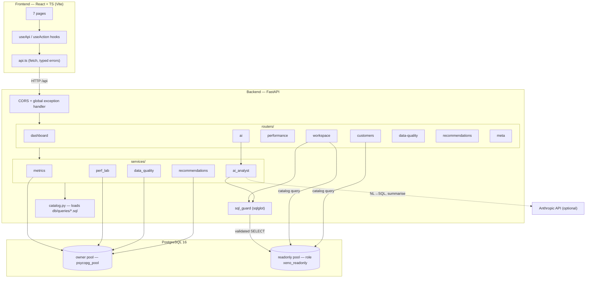

# Architecture

## Goals that shaped the design

1. **SQL is the product.** The analytical queries live in `db/queries/*.sql` as
   the single source of truth and are loaded by the API at startup. The same
   files power the SQL Workspace catalog, the Customer Analytics pages, and the
   AI Analyst's rule-based fallback.
2. **Never fabricate a number.** Every figure the UI shows is returned by a query
   executed during that request. The AI Analyst is explicitly constrained to the
   rows it is given.
3. **User SQL is hostile by default.** Anything a user or the LLM writes is
   parsed, structurally validated, and executed on a least-privilege role.

## Components

## Request flows

### Dashboard
`GET /api/dashboard/summary` → `metrics.dashboard_summary()` runs one wide
per-customer CTE for the KPI block, then targeted queries for retention,
campaign conversion, at-risk, the 12-month trend, RFM segment rollup and
freshness. Results are cached in-process for `DASHBOARD_CACHE_TTL_S` (default
60s); `?refresh=true` bypasses it.

### SQL Workspace — custom SQL
`POST /api/workspace/run {sql}` →
`sql_guard.validate()` (parse, structure, allow-list, deny-list, wrap with
`LIMIT`) → `db.run_readonly()` on the `xeno_readonly` pool inside
`SET TRANSACTION READ ONLY` + `SET LOCAL statement_timeout` → `ROLLBACK` →
optional `EXPLAIN (ANALYZE, BUFFERS, FORMAT JSON)` on the same pool.

### Performance Lab
`POST /api/performance/scenarios/{id}/benchmark` → look up the server-defined
`Scenario` → on the **owner** connection (autocommit, DDL allowed):
`before_setup` (e.g. `DROP INDEX`) → warm + measured `EXPLAIN ANALYZE` →
`after_setup` (e.g. `CREATE INDEX`) → warm + measured `EXPLAIN ANALYZE` →
`restore` (recreate production index) → parse both plans → return the
comparison. A process-wide lock serialises benchmark runs so concurrent DDL
can't collide.

### AI Analyst
`POST /api/ai/ask {question}` →
`llm_generate_sql()` if `ANTHROPIC_API_KEY` is set, else `rule_based_sql()`
(regex → catalog query or inline template) → `sql_guard.validate()` (same guard
as the Workspace; failure = not executed) → `db.run_readonly()` →
`llm_summarise()` (strictly grounded) or `template_summarise()` (restates the
real numbers) → response carries `engine`, `summary_engine`, the SQL, the rows,
and the 5-field recommendation.

## Why these technology choices

| Choice | Reason |
|---|---|
| **PostgreSQL** | Window functions, `FILTER`, `INCLUDE` indexes, partitioning, `EXPLAIN (ANALYZE, BUFFERS)` — the features the JD asks to demonstrate. |
| **psycopg 3 + psycopg_pool** | Native `EXPLAIN` handling, simple pooling, two pools for two privilege levels. |
| **sqlglot** | Dialect-aware SQL parser → structural validation instead of brittle regex. |
| **FastAPI** | Typed request models, automatic OpenAPI docs, minimal boilerplate. |
| **Vite + React + Recharts** | Fast dev loop; Recharts covers every chart here without custom D3. |
| **Rule-based AI fallback** | The AI-native workflow (generate → validate → run → ground) is demonstrable offline; the LLM upgrades quality, it isn't a hard dependency. |

## Failure handling

- API: a global exception handler returns `{"ok": false, "error": "..."}` with a
  500; expected domain errors (bad `query_id`, unknown scenario, guard rejection)
  return structured 4xx / `{"ok": false}` bodies the UI renders inline.
- DB down: `/api/ready` reports `degraded`; pages show an error state with retry.
- Frontend: `useApi` tracks `{data, loading, error}`; every page has explicit
  loading / error / empty states.
