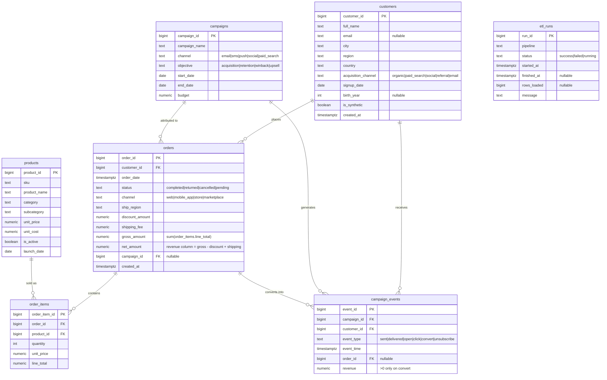
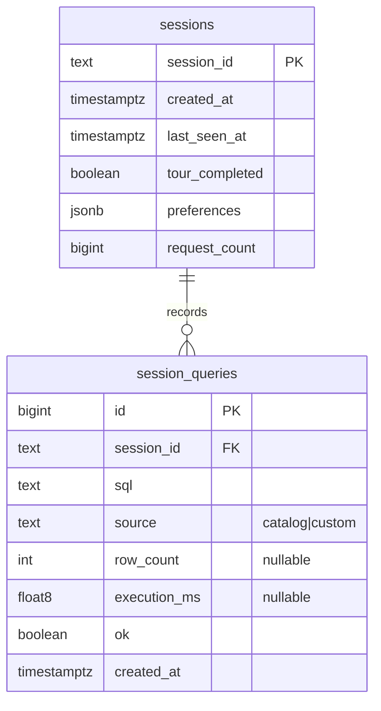

# Database schema

All data is **synthetic** (`is_synthetic = TRUE`), generated by
[`db/seed.sql`](../db/seed.sql). DDL: [`db/schema.sql`](../db/schema.sql).

## ER diagram

### Session tables (not part of the retail model)

Anonymous, cookie-driven (`xeno_session`, HMAC-signed, HttpOnly). Created in
`db/schema.sql` and also idempotently by the API on startup, so existing volumes
pick them up without a migration. No personal data is stored.

## Conventions

- **Money**: `NUMERIC(10,2)` / `NUMERIC(12,2)`, never float.
- **Revenue** always means `SUM(orders.net_amount) WHERE status = 'completed'`
  unless a query says otherwise.
- **Campaign conversion rate** = `convert` events ÷ `sent` events in
  `campaign_events`.
- Surrogate keys are `BIGINT`, contiguous from 1 (the seed relies on this to pick
  random FKs without a lookup).
- `orders.gross_amount` / `net_amount` and `order_items.line_total` are stored
  (denormalised) on purpose, so the aggregation-optimisation demos have a
  realistic choice between recomputing and reading a covering index.

## Indexes

Created by [`db/indexes.sql`](../db/indexes.sql) after the seed:

| Index | Table | Purpose |
|---|---|---|
| `ix_orders_customer_id` | orders | customer-level joins/filters |
| `ix_orders_order_date` | orders | revenue trend / cohort range scans |
| `ix_orders_completed_date` *(partial: `status='completed'`)* | orders | hot revenue path |
| `ix_orders_campaign_id` *(partial: `campaign_id IS NOT NULL`)* | orders | attribution joins |
| `ix_orders_cust_status_incl` *(`(customer_id,status) INCLUDE (net_amount,order_date)`)* | orders | covering index for LTV aggregation / `SELECT *` demo |
| `ix_order_items_order_id`, `ix_order_items_product_id` | order_items | join keys |
| `ix_campaign_events_campaign_id`, `ix_campaign_events_customer_id` | campaign_events | join keys |
| `ix_campaign_events_type_time` *(`(event_type,event_time) INCLUDE (campaign_id,revenue)`)* | campaign_events | funnel filters, index-only revenue rollups |
| `ix_customers_signup_date`, `ix_customers_acquisition_channel` | customers | cohort / channel analysis |

The Performance Lab drops and recreates `ix_campaign_events_type_time` and
`ix_orders_cust_status_incl` during benchmarks, then restores them.

## Partitioned table (optional)

[`db/partitioning.sql`](../db/partitioning.sql) builds
`campaign_events_part`, a `RANGE (event_time)` table with monthly partitions
(2022-01 … 2026-01) and local indexes. Used only by the partition-pruning
scenario in the Performance Lab. It is **opt-in** (it roughly doubles the
largest table): run `make partition-demo` after the stack is up, or
`docker compose exec -T db psql -U xeno -d xenopulse < db/partitioning.sql`.
